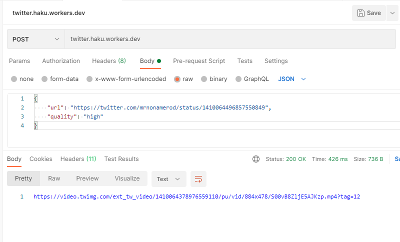

## Serverless Downloader

This is a cleaner version of [Twitter Downloader](https://github.com/VictorXLR/TwitterDownloader) written by me 
in an evening to operate with cloudflare workers. 

Unlike the existing project it has 
- Free Metrics
- Runs on Cloudflare 
- Doesnt Run on Heroku

Been really interested in playing around with serverless computing and this is my first repo for that issue

#### How to use 

Send a POST request to [twitter.haku.workers.dev](twitter.haku.workers.dev) with the payload structure of 
```HTTP
{
    "url": "url-to-tweet-with-video",
    "quality": "high"
}
```

Example:


